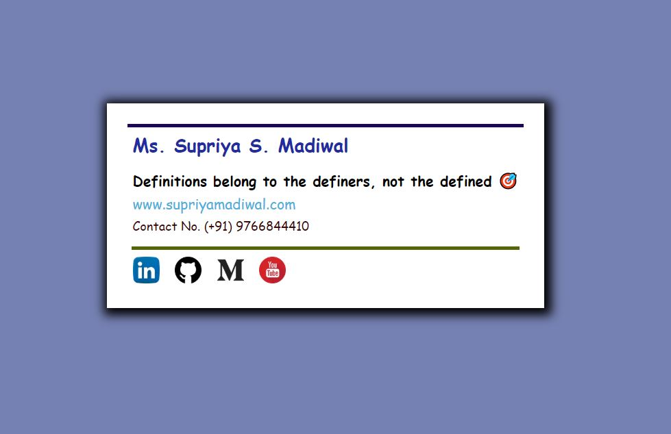

# E-mail-Signature
- I don’t put too much information in the signature so I don’t cause a sensory overload to the email recipient. I just included some links people may want to click to learn more about me and what i’m up to. If they want to get in touch with me, well they can reply to the email!

- The alignment of the elements in the signature is done using HTML tables. I didn’t use flexbox since I wasn’t sure how well it would show up on all devices. HTML tables, although a bit cumbersome to work with, seem to render fairly consistently across many devices and is well supported.

- Also, all the images in the signature need to be hosted somewhere like Google Drive. This is because the HTML image elements require a source URL and those images need to be pulled from some online server in order for the emails to render correctly.
All the CSS needs to be applied inline within the HTML elements. For some reason, emails don’t render correctly when you try targeting HTML element classes/ids using CSS.

<h4>Note :pushpin: </h4>

The source for the image is contained within my own personal Google Drive where the image has sharing settings that allow anyone to view the image. As a note, I had to change the sharing link provided by Google to include <b>uc?id=</b> at the beginning of the GET request in the URL. This allows for a direct download from Google Drive and makes sure the image appears correctly in the email signature.

<h3>Adding the HTML Signature to your Email :email: </h3>

If you’re using Gmail, you will have to copy the rendered HTML signature into Gmail.

---------------------------------------------------------------
<h3>Setup :</h3>

```
Save index.html and style.css in same directory structure.
Run index.html 
```


<h3> Have a glance </h3>
</img>	 


### Check Live Demo 
[EmailSignature](https://supriya1511.github.io/E-mail-Signature/)


